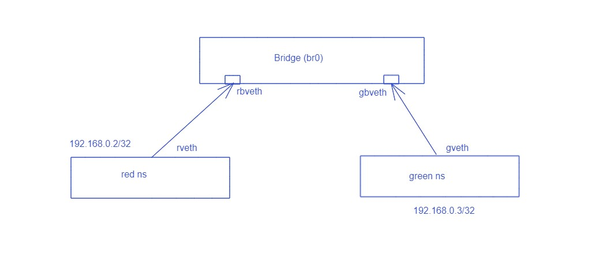

# Docker_network_Bridge-
Network Namespace in Docker 
# Network Namespace# Network Namespace with bridge network
Here we will create two network namespace and connect to the bridge network to communicate with each other

## Diagram


## Create two network namespace
```
sudo ip netns add red
sudo ip netns add green
```
To list the namespace
```
sudo ip netns list
```
## To Identify the netns
```
sudo ip netns exec red bash
ip netns identify
```

## Create a bridge network
```
sudo ip link add br0 type bridge
sudo ip link set dev br0 up
sudo ip addr add 192.168.0.1/16 dev br0
```

## Create Virtual Ethernet Cable (veth)
```
sudo ip link add rveth type veth peer name rbveth
sudo ip link add gveth type veth peer name gbveth
```

## Add two connector to two namespaces
```
sudo ip link set rveth netns red
sudo ip link set gveth netns green
```

## Turn on the connector
```
sudo ip netns exec red ip link set dev lo up
sudo ip netns exec red ip link set dev rveth up
sudo ip netns exec green ip link set dev lo up
sudo ip netns exec green ip link set gveth up
```

## Create two port in Bridge network
```
sudo ip link set dev rbveth master br0
sudo ip link set dev gbveth master br0
```

## Turn on the bridge connector
```
sudo ip link set dev rbveth up
sudo ip link set dev gbveth up
```

## Add Ip to Interfaces of Namespaces
```
sudo ip netns exec red bash
ip addr add 192.168.0.2/24 dev rveth

sudo ip netns exec green bash
ip addr add 192.168.0.3/24 dev gveth
```

It can't be /32. if we provide the cidr with /32, routing to the internet will fail

## Add the routing information via bridge
We need to add bridge ip address to the route table of namespace
```
sudo ip netns exec red ip route add default via 192.168.0.1 dev rveth
sudo ip netns exec green ip route add default via 192.168.0.1 dev gveth
```

Now we can ping green namespace from red using green namespace ip address and vice-versa

```
sudo ip netns exec red ping 192.168.0.3
sudo ip netns exec green ping 192.168.0.2
```


## Add Iptables rule to access the internet
Now, we want to access the internet from any namespace
```
cat /proc/sys/net/ipv4/ip_forward
```
We will see output **0** We need to change **ip_forward** value to **1**
```
sudo -i
sysctl -a | grep ip_forward
sysctl -w net.ipv4.ip_forward=1
sysctl -p
```

### Flush nat rules and masquerade
```
sudo iptables -t nat -F
sudo iptables -t nat -A POSTROUTING -s 192.168.0.1/16 ! -o br0 -j MASQUERADE
```


# Network Namespace with bridge network
Here we will create two network namespace and connect to the bridge network to communicate with each other

## Diagram


## Create two network namespace
```
sudo ip netns add red
sudo ip netns add green
```
To list the namespace
```
sudo ip netns list
```
## To Identify the netns
```
sudo ip netns exec red bash
ip netns identify
```

## Create a bridge network
```
sudo ip link add br0 type bridge
sudo ip link set dev br0 up
sudo ip addr add 192.168.0.1/16 dev br0
```

## Create Virtual Ethernet Cable (veth)
```
sudo ip link add rveth type veth peer name rbveth
sudo ip link add gveth type veth peer name gbveth
```

## Add two connector to two namespaces
```
sudo ip link set rveth netns red
sudo ip link set gveth netns green
```

## Turn on the connector
```
sudo ip netns exec red ip link set dev lo up
sudo ip netns exec red ip link set dev rveth up
sudo ip netns exec green ip link set dev lo up
sudo ip netns exec green ip link set gveth up
```

## Create two port in Bridge network
```
sudo ip link set dev rbveth master br0
sudo ip link set dev gbveth master br0
```

## Turn on the bridge connector
```
sudo ip link set dev rbveth up
sudo ip link set dev gbveth up
```

## Add Ip to Interfaces of Namespaces
```
sudo ip netns exec red bash
ip addr add 192.168.0.2/24 dev rveth

sudo ip netns exec green bash
ip addr add 192.168.0.3/24 dev gveth
```

It can't be /32. if we provide the cidr with /32, routing to the internet will fail

## Add the routing information via bridge
We need to add bridge ip address to the route table of namespace
```
sudo ip netns exec red ip route add default via 192.168.0.1 dev rveth
sudo ip netns exec green ip route add default via 192.168.0.1 dev gveth
```

Now we can ping green namespace from red using green namespace ip address and vice-versa

```
sudo ip netns exec red ping 192.168.0.3
sudo ip netns exec green ping 192.168.0.2
```


## Add Iptables rule to access the internet
Now, we want to access the internet from any namespace
```
cat /proc/sys/net/ipv4/ip_forward
```
We will see output **0** We need to change **ip_forward** value to **1**
```
sudo -i
sysctl -a | grep ip_forward
sysctl -w net.ipv4.ip_forward=1
sysctl -p
```

### Flush nat rules and masquerade
```
sudo iptables -t nat -F
sudo iptables -t nat -A POSTROUTING -s 192.168.0.1/16 ! -o br0 -j MASQUERADE
```


## Create two namespace
```bash
sudo ip netns add red
sudo ip netns add green
```
## List of namespace
```bash
sudo ip netns list
```
## Navigate to Namespace
```bash
sudo ip netns exec red bash
```
Here after **exec** we put the name of the namespace

## Create a virtual ethernet cable (veth)
This virtual ether net cable we will use to connect to namespace
```
sudo ip link add rveth type veth peer name gveth
```
Here **rveth** is one connector of virtual ethernet cable and **gveth** is another connector of virtual ethernet cable

## list the connector
```bash
sudo ip link list
```
We can see the both connector i.e **rveth** and **gveth** from namespace because it still not associated to any nameaspace. When we add those to the namesapce we can't see that from host namespace

## Assign two virtual connector to namespaces
```bash
sudo ip link set rveth netns red
sudo ip link set gveth netns green
```

Now we assign the connector to the namespaces

We can see the interface from the namespaces now, not from host namespaces
To check the interface, we need to navigate to namespaces and run **ip addr**

```bash
sudo ip netns exec red bash
ip addr
```
you will see two interface, **lo** i.e loop back and **rveth** and both are in **DOWN** state

Now we need to turn it ON

## Turn on the interfaces
```bash
sudo ip netns exec red ip link set dev lo up
sudo ip netns exec red ip link set dev rveth up
sudo ip netns exec green ip link set dev lo up
sudo ip netns exec green ip link set dev gveth up
```

## Assign IP address to interface
Assign IP address to newly created interface i.e rveth and gveth
```bash
sudo ip netns exec red bash
ip addr add 10.10.1.2/32 dev rveth

sudo ip netns exec green bash
ip addr add 10.10.1.3/32 dev gveth
```

Now if we ping from one namespace to another namespace it will not work. because we have nothing in route table in both namespace
if we run 
``` 
route
```
we will get empty output in both namespace

Now, we need to add routing information

## Add routing information
```bash
sudo ip netns exec red bash
ip route add 10.10.1.3/32 dev rveth

sudo ip netns exec green bash
ip route add 10.10.1.2/32 dev gveth
```

Now we can communicate between two namespaces


## Bash Script command 
#!/bin/bash
sudo ip netns add red
sudo ip netns add green

sudo ip link add br0 type bridge
sudo ip link set dev br0 up
sudo ip addr add 192.168.0.1/16 dev br0

sudo ip link add rveth type veth peer name rbveth
sudo ip link add gveth type veth peer name gbveth

sudo ip link set rveth netns red
sudo ip link set gveth netns green

sudo ip netns exec red ip link set dev lo up
sudo ip netns exec red ip link set dev rveth up
sudo ip netns exec green ip link set dev lo up
sudo ip netns exec green ip link set gveth up

sudo ip link set dev rbveth master br0
sudo ip link set dev gbveth master br0

sudo ip link set dev rbveth up
sudo ip link set dev gbveth up

sudo ip netns exec red ip addr add 192.168.0.10/24 dev rveth
sudo ip netns exec green ip addr add 192.168.0.20/24 dev gveth

sudo ip netns exec red ip route add default via 192.168.0.1 dev rveth
sudo ip netns exec green ip route add default via 192.168.0.1 dev gveth

sudo iptables -t nat -F
sudo iptables -t nat -A POSTROUTING -s 192.168.0.1/16 ! -o br0 -j MASQUERADE

